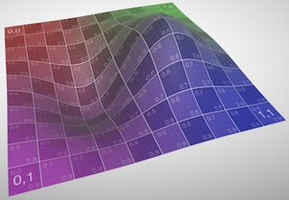

# Java glTF MeshBuilder

This project transforms simple 2D arrays into 3D meshes represented as glTF models. The meshes can be planar or wrapped about the x-axis or y-axis to generate cylindrical and spherical shapes that include:

1. **Planar:** The points are connected to create a 2D terrain with elevations. 
1. **Lathe:** The edge of the y-axis is wrapped to create cylindrical shapes. 
1. **Manifold:** Both axes are wrapped to create solid spherical shapes. 

The [MeshBuilder][MESHBUILDER] class provides a fluent interface that saves effort because only the locations of vertices need to be specified. Normal vectors are calculated automatically to provide smooth and  interpolated reflections from the surface. The resulting glTF model includes:

* **Triangle indices:** Indicates which points should render triangles 
* **Texture coordinates:** Maps points on a texture to a mesh 
* **Normal Vectors:** Used to interpolate reflections off surfaces so they appear smooth 
* **glTF buffers:** Binary data stored in a glTF file that contains geometry

The builder will assume that points in the array should be connected in a square grid. Triangular geometries are not supported. You can optionally specify a PNG or JPEG texture and coordinates will automatically be interpolated to fit.

The [GltfWriter][WRITER] leverages the [JglTF][JGLTF] library to hide some complexities of generating glTF files.

[MESHBUILDER]: <src/main/java/com/kinetica/mesh/MeshBuilder.java>
[WRITER]: <src/main/java/com/kinetica/mesh/GltfWriter.java>
[JGLTF]: <https://github.com/javagl/JglTF>

## Demo Models

JUnit tests in `com.kinetica.mesh.demo` provide examples for generating glTF models using various methods with and without textures. You can generate the models by running `maven test` or by launching the JUnit tests from eclipse. Generated files will be placed in `./demo`. You can see the results with an online [glTF Viewer][VIEWER].

Below is a summary of the JUnit tests. These can be executed with `maven test`.

| Test Name | Description |
| :--- | :--- |
| [TestShapeModels.testPlane()][DEMO_SHAPES] | Generate 3D graph addPlane(). |
| [TestShapeModels.testDiamond()][DEMO_SHAPES] | Generate a diamond shape  addPlane(). |
| [TestShapeModels.testHelix()][DEMO_SHAPES] | Generate a textured helix with addLathe(). |
| [TestShapeModels.testTorus()][DEMO_SHAPES] | Generate a textured torus with addManifold(). |
| [TestCubeModel.testBox()][DEMO_CUBE] | Generate a cube with textures on all sides. |
| [TestLineModel.testLineModel()][DEMO_LINE] | Generate lines with different colors. |

[VIEWER]: <https://gltf-viewer.donmccurdy.com/>
[DEMO_SHAPES]: <src/test/java/com/kinetica/mesh/demo/TestShapeModels.java>
[DEMO_CUBE]: <src/test/java/com/kinetica/mesh/demo/TestCubeModel.java>
[DEMO_LINE]: <src/test/java/com/kinetica/mesh/demo/TestLineModel.java>

### Plane

The surface uses the API `Meshbuilder.addPlane()` to render a simple function. The function is calcuated for each grid point and a texture is added to the surface.

### Diamond

The diamond shape is generated from passing a 12x3 grid to `Meshbuilder.addLathe()` which joins the grid around the y-axis to form a cylindrical shape. At each of the 3 points on the y-axis the API `Meshbuilder.addCircleVerticesXZ()` is called to generate a 12-sided circle. Instead of providing a textue colors are specified for each of the circles that get interpolated.

### Heix

The helix is generated by passing a 12x60 grid to `Meshbuilder.addLathe()`. For each of the 60 steps along the y-axis the API `Meshbuilder.addCircleVerticesXZ()` is called to generate a 12-sided circle. The radius of the circle is moved up the y-axis with a helix motion. `MeshBuilder.build()` is passed a a texture which is fitted around the surface.

### Torus

The torus is constructed with `Meshbuilder.addManifold()` that will join the x-axis and y-axis. It is constructed from circles along the XZ horizontal plane that start on the outer radius and move around the edge to the inner radius. It results in a 12x48 size grid that is fitted with a texture and joined on both axis.

### Cube

The cube gives an example of how to generate models using more primitive API's. Each vertex is created using `Meshbuilder.newVertex()`. These are passed to `Meshbuilder.addSquare()` to generate each of the 6 faces. Because it does not call one of the mesh generator routines It must manually add texture coordinates with `MeshVertex.setTexCoord()`; however, normals are still generated automatically.

### Line

Lines can be constructed with help of the mesh mode. `GeometryBuidler.build` method has a parameter in order to switch this attribute; `_meshPrimitive`.

## MeshBuilder Workflow

This section describes the basic process of using the MeshBuilder. The process involves creating a 2D array of vertex objects that represent points on the grid. See the JUnit test cases below for more details.

1. Create one or more a `MeshBuilder` objects. Each of these will result in a single glTF mesh. Name is a required parameter for the `MeshBuilder` and will be referenced in the logs and the resulting file.

1. Optionally call `MeshBuilder.setCenter()`, `MeshBuilder.setScale()`, or `MeshBuilder.setTransform()` to transform the size and position of the resulting geometry. These methods will cause points to be transformed as they are added and do not use any glTF transform API.

1. Create an empty 2D array of `MeshVertex` objects. Each vertex represents a point on a rectangular grid that will be curved in 3D space.

1. Populate the `MeshVertex` array with values. Call `MeshBuilder.newVertex()` to create the points. You can optionally assign a color to the vertex if the mesh will not be textured.

1. Call `MeshBuilder.addPlane()`, `MeshBuilder.addLathe()`, or `MeshBuilder.addManifold()` to populate the mesh with geometry. At the lowest level this 
will add triangles to the mesh.

1. Create a `GltfWriter`. Optionally call `GltfWriter.setAlphaMode()` to indicate if the mesh should be viewable from both sides.

1. Call `GltfWriter.addMaterial()` to create the glTF material for the surface. For textures this should specify an image file.

1. Add each mesh to the file by calling `_meshBuilder.build()`.

1. Call `GltfWriter.writeGltf()` to create the file. You can specify a `glb` or `gltf` extension to indicate the file format.

## Internals

### Normals Algorithm

The `MeshBuilder` class has the capability to automatically compute normals for any type of geometry without effort from the user. Normals are vectors that point perpendicular to the plane at each vertex and are necessary for the renderer to properly calculate  shading interpolations for a surface. This interpolation gives the appearance of a smooth surface when the wireframe has limited detail. 

Below is an exmaple of the of the same wireframe with and without vertex normals. Without the normals the renderer is lacking information about the surface and has no option except to simulate normals independently for each triangle.

Some apporaches to computing the normals involve [manually calculating the derivative][DERIVATIVE] of the surface which requires considerable effort. The `MeshBuilder` uses a relatively simple algorithm where normals for each vertex are calcuated from the average contribution of each triangle that includes it.

Above we can see an example of a minimal grid with 3x3 vertices, 2x2 square cells, and 8 triangles. The vertex in the center is shared by 6 triangles and its normal can be calculated by averaging the normals of each of its surrounding triangles. In this case the north/south and east/west contributions of the triangle normals will cancel and the vertex normal will point directly up.

The normals calculation requires that all triangles are added to the wireframe before the normals are calculated. The steps are as follows:

1. Any time a shape is added with the MeshBuilder it will eventually call `GeometryBuilder.addTriangle()` for every triangle to be added. 
2. `GeometryBuilder.addTriangle()` will calculate the normal of the triangle and it to a list of normals in `MeshVertex` for each of the 3 vertices.
3. Afer all triangles are added `GeometryBuilder.build()` will average the normals for each `MeshVertex` to calculate the normals.

[DERIVATIVE]: <https://www.scratchapixel.com/lessons/procedural-generation-virtual-worlds/perlin-noise-part-2/perlin-noise-computing-derivatives>

### Buffer Serialization

The MeshBuilder leverages the [JglTF][JGLTF] library which can manipulate metadata but JglTF has no functionality to manipulate the glTF buffer which contains the geometry. The lower level functions of the MeshBuilder fill this gap by allowing for geometry primitives to be set and serialized the buffer.

A glTF file consists of 3 basic types of data:

* **JSON metadata**: You can see this if you open the glTF file with a text editor. 
* **Binary buffer**: This is base64 encoded data containing lists of geometry data.
* **Images**: This is base64 encoded containing JPG images.

The metadata is a hierarchy of objects which at the lowest level provides access to the data buffer. For a detailed specification see the [glTF Specification][GLTF_SPEC].

1. `Buffer`: At this lowest level the data is a raw sequence of bytes.
2. `BufferView`: This object references a section of the of the buffer. 
3. `Accessor`: Abstracts raw bytes as primitives vectors or scalars.
4. `Material`: Indicates surface features of Mesh like texture and reflectivity.
5. `Mesh`: Pulls together Accessors and a Material to define a surface.
6. `Node`: Groups a set of meshes into an object.
7. `Scene`: Groups a set of Nodes

Buffer serialization starts in `GeometryBuilder.buildBuffers()`. It constructs a set of serializers subclassed from `mesh.buffer.BaseBuffer` to handle each type of primitive:

* `Vertices`: A list of 3D points.
* `TexCoords`: A list of 2D points that map a texture to a position on a Mesh.
* `VertexColors`: A list of RGB colors for vertices.
* `Normals`: A list of 3D vectors that are orthogonal to the surface at each vertex.
* `Tangents`: A list of 4D vectors that are tangent to the surface at each vertex.
* `TriangleIndices`: Indices that reference vertices in groups of 3 for drawing triangles.

*Note: The `Tangents` serializer is currently a partially implemented feature used for bump mapping.*

Except for `TriangleIndices` each of the serializers should have N values where N is the number of vertices. For example if there are N vertices then there should be N normal vectors and N texture coordinates for the vertices.

The serializers are populated with data from the MeshVertex list. Next their `BaseBuffer.build()` is called which will serialize contents to the buffer and add necessary JSON metadata.

[GLTF_SPEC]: <https://github.com/KhronosGroup/glTF/blob/master/specification/2.0/README.md>

## API Summary

High level classes that generate 3D models:

| Class Name | Description |
| :--- | :--- |
| mesh.GltfWriter | Generate glTF binary and JSON encoded files |
| mesh.GeometryBulder | Generate meshes based on shape primitives. |
| mesh.MeshBuilder | Generate 3D surfaces from an array of MeshVertex objects. |
| mesh.MeshVertex | Contains all information to describe a point in a mesh. |

Classes used to generate 3D primitives:

| Class Name | Description |
| :--- | :--- |
| mesh.buffer.BaseBuffer | Base class for primitive buffers |
| mesh.buffer.Normals | Normal vectors used for light interpolation |
| mesh.buffer.TexCoords | Coordinates used to map textures to vertices | 
| mesh.buffer.TriangleIndices | Map vertices to triangles | 
| mesh.buffer.VertexColors | Map colors to vertices |
| mesh.buffer.Vertices | Indicates a point in 3D space |

## glTF Resources

The following resources are useful for understanding the glTF specification.

* [glTF Overview](https://github.com/KhronosGroup/glTF/blob/master/README.md)
* [glTF Tutorial](https://github.com/KhronosGroup/glTF-Tutorials/blob/master/gltfTutorial/README.md)
* [glTF 2.0 Specification](https://github.com/KhronosGroup/glTF/blob/master/specification/2.0/README.md)
* [glTF Sample Models](https://github.com/KhronosGroup/glTF-Sample-Models)

## Author

Chad Juliano: <cjuliano@kinetica.com>

## License 

MIT License: http://spdx.org/licenses/MIT
